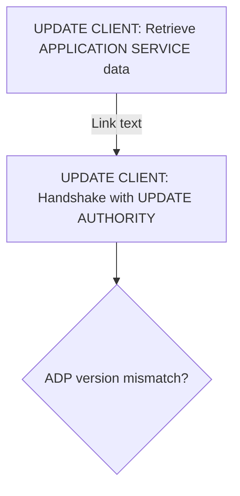
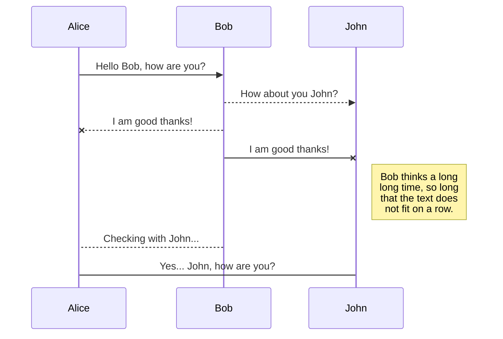

# Application Distribution Protocol

## Introduction

 - **Authors** 
	 - Oriol Egea: Definition and writting.
	 - Ricardo Quintanilla: Grammar and translation.
 - **Version** 1.0
 - **Status** Work In Progress
 - **Last Modification** Nov. 2020
 - **Released Under** CC BY-SA 4.0

Application Distribution Protocol (ADP) is a basic communication protocol built on top of web technologies, which aims to provide a standarized way for applications to check for new versions, and download them.

Although this is not an IETF document, the key words "MUST", "MUST NOT", "REQUIRED", "SHALL", "SHALL NOT", "SHOULD", "SHOULD NOT", "RECOMMENDED",  "MAY", and "OPTIONAL" in this document are to be interpreted as described in [RFC 2119](https://www.ietf.org/rfc/rfc2119.txt).

## Terminology

 - **Actor**: An actor is a part involved on the ADP flow. Each part is an independent system that has a concrete mission to achieve. Actors communicate between them to achieve the overall goal of this protocol. 
 - **Operation**: Actors participate in operations to achieve their specific goals. An operation is a logic flow in which one or more actors are involved. 
 - **Remote**: Anything will be considered remote if it is placed on a location different than the APPLICATION SERVICE. This would often apply to remote actors, which will normally communicate with local actors through the Internet.
 - **Local**: Anything will be considered local if it is placed on the same location than the APPLICATION SERVICE. Local actors will communicate between them over the local network.
 - **End-user**: A person who manually interacts with one or more actors.

## Intended Public

ADP aims to serve a very specific kind of public: It has been designed having in mind those applications that are normally distributed through installer wizards, and have lower complexity release processes. We found that on this specific kind of cases, a basic and easily adoptable protocol that allow to check and download updates through an external client, can drastically reduce the implementation and maintenance efforts.

ADP may work on other scenarios, in part thanks to that the update process is handled by an external client that is almost totally decoupled from the main application. However we are very concious that ADP is nothing revolutionary, and there are many better ways to distribute new software versions, specially in scenarios where continuous deployment or repositories can be adopted.

However, as ADP is easy to learn and implement, we encourage you to read this guide, and value the possibility of using it, if it fits well on your requirements.

## Used patterns, technologies, and protocols

Simplicity is one of the main goals of ADP,  we've described the protocol enforcing the usage of some patterns, technologies and protocols to achieve that simplicity and ensure easy implementation. Although this might go in detriment of extensibility of the protocol, we preferred to keep things simple.

Because of this, these are the patterns, technologies and protocols that you MUST use to ensure a valid ADP implementation:

 - **No dependencies between updates**: Your application MUST be able to be updated to the latest available version without installing intermediate updates, that means: If main application is at 1.0 version, and the latest is the 5.0, it MUST be capable to be directly updated to the version 5.0, skipping the 2.0, 3.0 and 4.0 previously released versions. 
 - **HTTPS**: All communication between actors MUST be done using the HTTPS protocol. Non-secure HTTP MUST NOT be used.
 - **BASIC AUTH**: In those operations in which authentication can be implemented, BASIC AUTH MUST be the way within one actor will send their credentials to other. 
 - **JSON**: Data transferred between actors MUST be formatted using [JSON](https://tools.ietf.org/html/rfc7159). 

## Actors involved

There are three main actors involved on ADP, they appear in this document always in UPPER CASE and using the following terms.

 - **UPDATE AUTHORITY.** 
 - **UPDATE CLIENT.**
 - **APPLICATION SERVICE.**

### UPDATE AUTHORITY
 
The UPDATE AUTHORITY is a remote actor which goal is to provide to the UPDATE CLIENT a list with the latest available versions of a software application. 

### UPDATE CLIENT

The UPDATE CLIENT is an application that connects to the UPDATE AUTHORITY to check if new version is available, and download it if needed. 

The UPDATE CLIENT MAY handle more than one software application at the same instance, allowing the end user to manage all their software updates from one single place.

### APPLICATION SERVICE

The APPLICATION SERVICE is a URI where there are details specified about the application to update. The APPLICATION SERVICE is checked by the UPDATE CLIENT to do the initial handshake with the rest of the actors, and to know which version of the software to update is installed.

## Operations 

ADP is divided in three main operations:

 - **UPDATE CLIENT configuration.**
 - **Available updates check and download.**
 - **Handshake between the UPDATE CLIENT and UPDATE AUTHORITY.**

### UPDATE CLIENT configuration

The first step on ADP is to configure the UPDATE CLIENT. In this operation, the end-user will provide to the UPDATE CLIENT with the URI with which to access the APPLICATION SERVICE. 

The UPDATE CLIENT will then do an HTTPS GET request to the indicated URI. In response to that request, the APPLICATION SERVICE MUST provide a JSON with the following data: 

 1. ADP version used by the APPLICATION SERVICE. This MUST be contained inside a string parameter named "protocolVersion".
 2. The UPDATE AUTHORITY's URL. This MUST be contained inside a string parameter named "updateAuthorityUr".
 3. Current installed version. This MUST be contained inside a string parameter

This request MUST NOT require the usage of authentication mechanisms. 

The provided JSON MUST use these parameter names:

```json
{
}
```

### Overall Process Overview

These are main actions of ADP expressed on a flowchart indicating also who is the actor responsible for start each of them:

>Operations are represented as squares, conditions as rhombus.



## UML diagrams

You can render UML diagrams using [Mermaid](https://mermaidjs.github.io/). For example, this will produce a sequence diagram:



<!--stackedit_data:
eyJoaXN0b3J5IjpbMjE0MjEwMzMzOCwtMzIwNDY1NTg1LDE5ND
k3ODg4NDQsLTE3OTAwMDQ4NDcsLTY3NTI1NDUxNSw1MzAyNTQw
OTQsMTExNTk4NDU3MiwtMzIzMDYxNTc2LDE0OTk5MTc5MTQsLT
YwMzQxNzUzNF19
-->